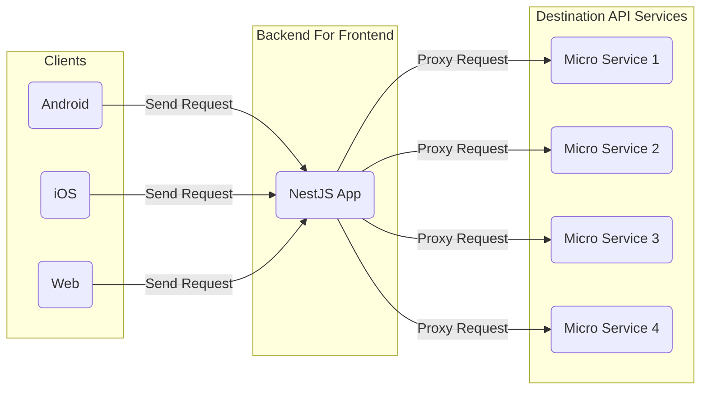
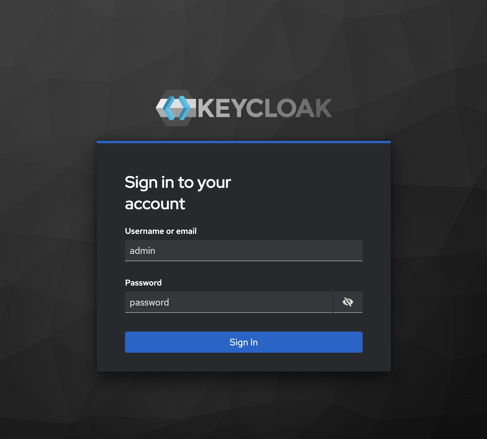
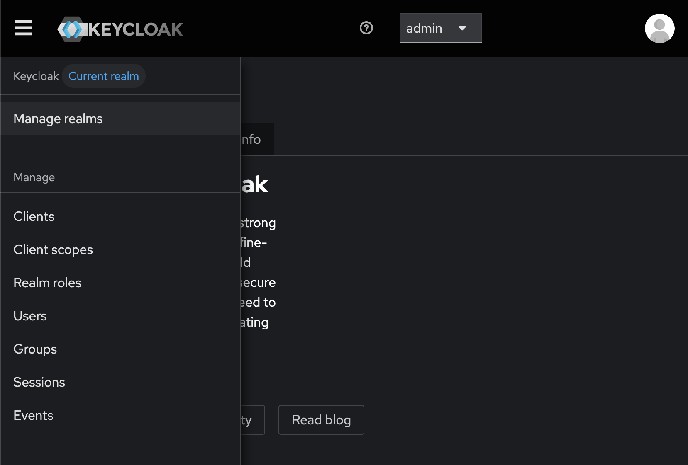
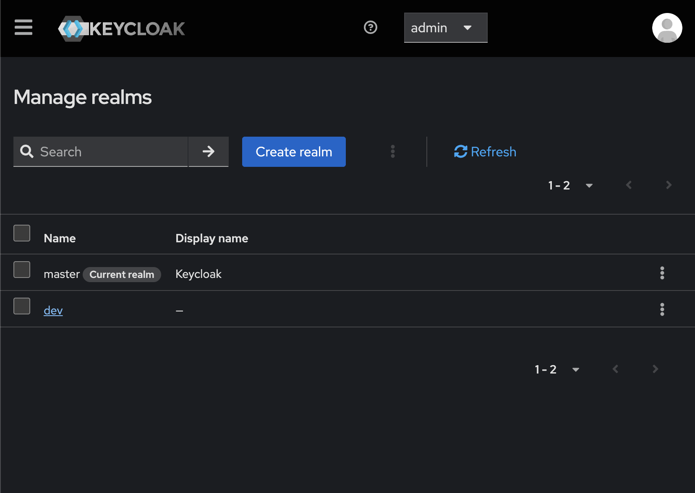
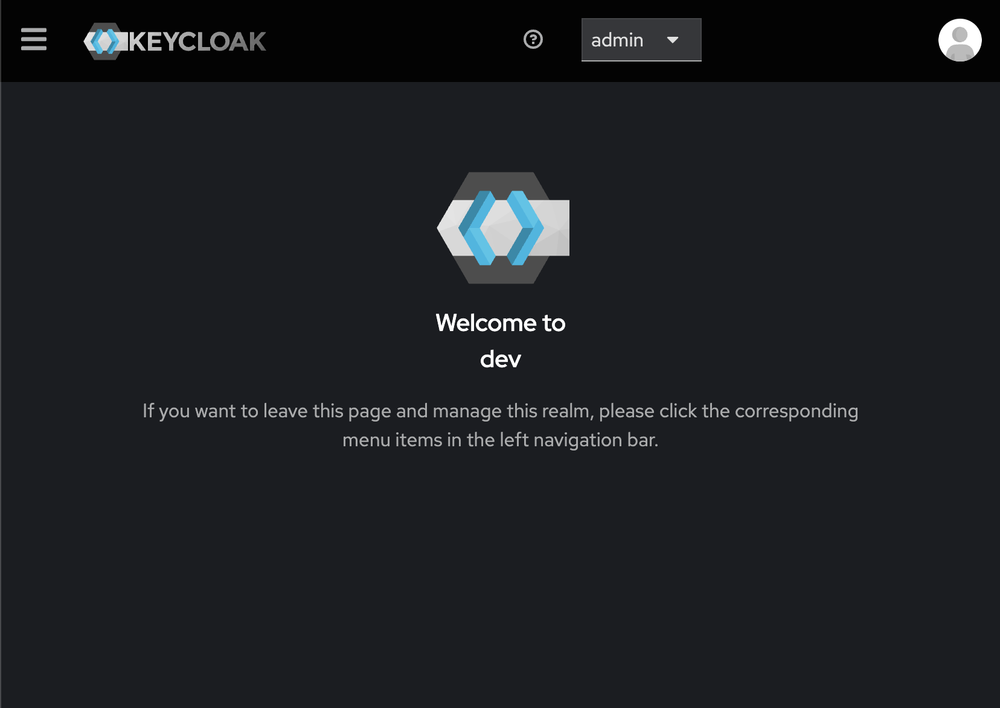
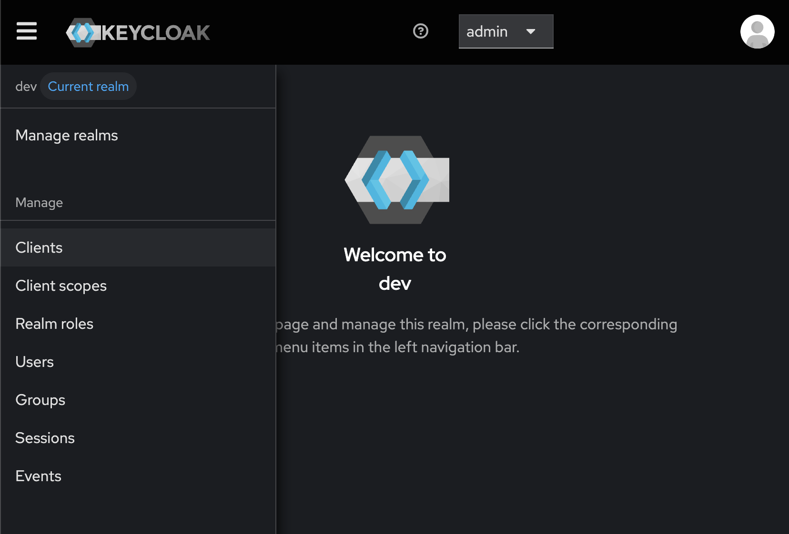
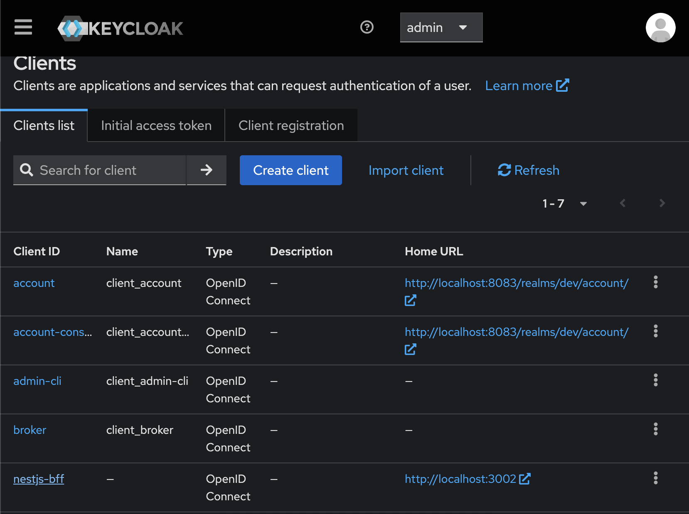

# NestJS-BFF

[](https://github.com/ogi-iii/nestjs-bff/actions/workflows/coveralls.yml)
[](https://coveralls.io/github/ogi-iii/nestjs-bff?branch=main)

This is the project of "Backend For Frontend" (called "BFF") using [NestJS](https://docs.nestjs.com/).



## Features

The API endpoints of this BFF can be customized with YAML configuration files.

The supported types of API endpoint of this BFF is listed in below.

- HTTP Request Proxy (GET / POST / PUT / PATCH / DELETE)
  - which can authorize via session cookie with automatic exchange for the OpenID Connect access token cached in Redis
- User authentication via OpenID Connect Authorization Code Flow
  - which automatically handles state, nonce, and PKCE

## Requirements

- Docker (version 28.3.2 or later)
- Docker Compose (version 2.39.1 or later)
- Node (version 22.14.0 or later)
- npm (version 10.9.2 or later)

## Getting started

### 1. Run the Keycloak and Redis Containers with Docker Compose

```bash
$ docker compose up -d
```

### (Optional) Check if the Keycloak and Redis Containers is Ready to Connect

```bash
# Keycloak
$ curl -o /dev/null -s -w "%{http_code}\n" http://localhost:8083 | grep -Eq '^302$' \
&& echo "Keycloak is ready to connect." \
|| echo "Keycloak is NOT ready. Please wait a moment."

# Redis
$ printf '*1\r\n$4\r\nPING\r\n' | nc localhost 6376 | tr -d '\r' | grep -Eq '^\+PONG$' \
&& echo "Redis is ready to connect." \
|| echo "Redis is NOT ready. Please wait a moment."
```

### 2. Get Keycloak Client Secret

> [!NOTE]
> Keycloak `dev` realm will be automatically created by importing it from the JSON when the container starts.

#### 2.1. Login Keycloak as Admin User

> [!NOTE]
> You can change your Keycloak admin username and password by modifying the values of environment variables in `docker-compose.yaml`.



#### 2.2. Select Keycloak Realm: `dev`







#### 2.3. Select Keycloak Client: `nestjs-bff`





#### 2.4. Copy Keycloak Client Secret


### 3. Edit Environment Variables

**Default environment variables are defined in `.env` file.**

> [!IMPORTANT]
> Please set the environment variable `KEYCLOAK_CLIENT_SECRET` with the value you copied from the Keycloak console.

| Variable Name | Explanation | Default Value |
| ------------- | ----------- | ------------- |
| YAML_CONFIG_DIR_PATH | Directory Path of Yaml Config Files | `./config` |
| NEST_APP_HOST | Server Host of NestJS Application | `localhost` |
| NEST_APP_PORT | Server Port of NestJS Application | `3002` |
| KEYCLOAK_HOST | Server Host of Keycloak | `localhost` |
| KEYCLOAK_PORT | Server Port of Keycloak | `8083` |
| KEYCLOAK_REALM_NAME | Realm Name of Keycloak | `dev` |
| KEYCLOAK_SCOPE | Scope for Access Token from Keycloak | `openid` |
| KEYCLOAK_CLIENT_ID | Client ID of Keycloak | `nestjs-bff` |
| KEYCLOAK_CLIENT_SECRET | Client Secret of Keycloak | `<YOUR_KEYCLOAK_CLIENT_SECRET>` |
| REDIS_HOST | Server Host of Redis Cache Server | `localhost` |
| REDIS_PORT | Server Port of Redis Cache Server | `6376` |

### 4. Install Package Dependencies

```bash
$ npm install
```

### (Optional) Execute Tests for the NestJS App

```bash
# unit tests
$ npm run test

# e2e tests
$ npm run test:e2e

# test coverage
$ npm run test:cov
```

### 5. Run the NestJS App

```bash
# development
$ npm run start

# watch mode
$ npm run start:dev

# production mode
$ npm run start:prod
```

### 6. Try to Access API Endpoints of the NestJS App!

**API endpoints are defined on YAML files in `config/` directory.**

> [!NOTE]
> You can login with the below user for testing the API: `/api/auth/login`
> - username: `myuser`
> - password: `P@ssw0rd!`
>
> Then, the OIDC (OpenID Connect) session cookie will have been automatically set when your user login process was succeeded.

| API Endpoint | Method | Query Parameters | Request Body | Request Headers |
| ------------ | ------ | ---------------- | ------------ | --------------- |
| /api/posts | GET | - | - | - |
| /api/posts | POST | - | {"name":"`<ANY_NAME>`", "email":"`<ANY_EMAIL>`"} | Content-Type: application/json |
| /api/auth/login | GET | - | - | - |
| /api/comments | GET | postId=`<ANY_NUMBER>` | - | Cookie: `<YOUR_OIDC_SESSION_COOKIE>` |
| /api/posts/comments | GET | postId=`<ANY_NUMBER>` | - | Cookie: `<YOUR_OIDC_SESSION_COOKIE>` |

### (Optional) Shutdown and Remove the Keycloak and Redis Containers with Docker Compose

```bash
$ docker compose down
```

## See Also

- Sample Destination API Service
  - [JSONPlaceholder - Free Fake REST API](https://jsonplaceholder.typicode.com/)
