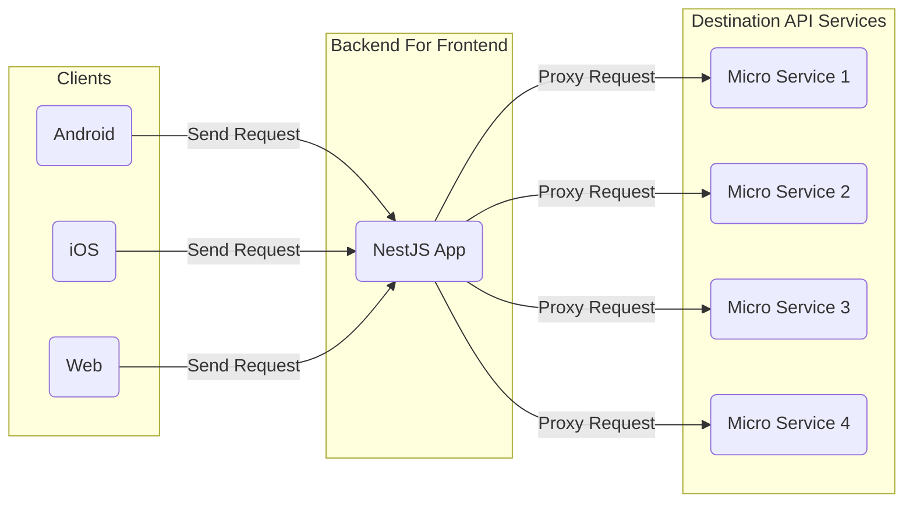
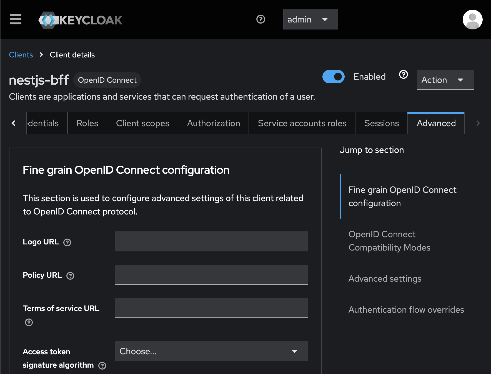
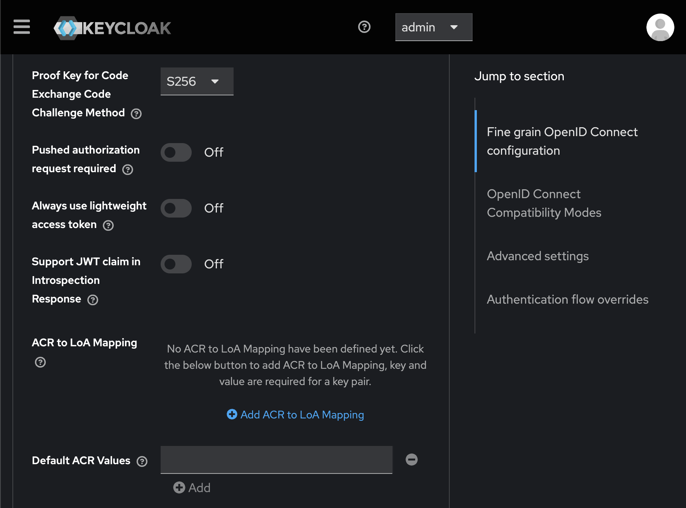

# NestJS-BFF

[](https://coveralls.io/github/ogi-iii/nestjs-bff)

This is the project of "Backend For Frontend" (called "BFF") using [NestJS](https://docs.nestjs.com/).



## Features

The API endpoints of this BFF can be customized with YAML configuration files.

The supported types of API endpoint of this BFF is listed in below.

- HTTP Request Proxy (GET / POST / PUT / PATCH / DELETE)
  - with Authorization by Token Introspection (OAuth 2.0)
- Authentication by Authorization Code Flow (OAUTH 2.0 / OpenID Connect)
- Re-Authentication by Token Refresh (OAUTH 2.0 / OpenID Connect)

## Requirements

- Docker (version 27.2.0 or later)
- Node (version 20.12.1 or later)
- npm (version 10.9.0 or later)

## Getting started

### 1. Run the Keycloak Container

```bash
$ ./run-keycloak-container.sh [<PORT> <ADMIN_USERNAME> <ADMIN_PASSWORD>]
```

### 2. Setup Keycloak

#### 2.1. Login Keycloak as Admin User


#### 2.2. Create Keycloak Realm


#### 2.3. Create Keycloak Client


#### 2.4. Get Keycloak Client Secret


#### 2.5. Move to Keycloak Client Advanced Settings Tab



#### 2.6. Set Keycloak Client PKCE Code Challenge Method



#### 2.7. Create Keycloak User


#### 2.8. Set Keycloak User Password


### 3. Edit Environment Variables

**Default environment variables are defined in `.env` file.**

| Variable Name | Explanation | Default Value |
| ------------- | ----------- | ------------- |
| YAML_CONFIG_DIR_PATH | Directory Path of Yaml Config Files | `./config` |
| NEST_APP_HOST | Server Host of NestJS Application | `localhost` |
| NEST_APP_PORT | Server Port of NestJS Application | `3002` |
| KEYCLOAK_HOST | Server Host of Keycloak | `localhost` |
| KEYCLOAK_PORT | Server Port of Keycloak | `8083` |
| KEYCLOAK_REALM_NAME | Realm Name of Keycloak | `dev` |
| KEYCLOAK_SCOPE | Scope for Access Token from Keycloak | `openid` |
| KEYCLOAK_CLIENT_ID | Client ID of Keycloak | `nestjs-bff` |
| KEYCLOAK_CLIENT_SECRET | Client Secret of Keycloak | `<YOUR_KEYCLOAK_CLIENT_SECRET>` |

### 4. Install Package Dependencies

```bash
$ npm install
```

### (Optional) Execute Tests for the NestJS App

```bash
# unit tests
$ npm run test

# e2e tests
$ npm run test:e2e

# test coverage
$ npm run test:cov
```

### 5. Run the NestJS App

```bash
# development
$ npm run start

# watch mode
$ npm run start:dev

# production mode
$ npm run start:prod
```

### 6. Try to Access API Endpoints of the NestJS App!

**API endpoints are defined on YAML files in `config/` directory.**

| API Endpoint | Method | Query Parameters | Request Body | Request Headers |
| ------------ | ------ | ---------------- | ------------ | --------------- |
| /api/posts | GET | - | - | - |
| /api/posts | POST | - | {"name":"`<ANY_NAME>`", "email":"`<ANY_EMAIL>`"} | Content-Type: application/json |
| /api/auth/login | GET | - | - | - |
| /api/comments | GET | postId=`<ANY_NUMBER>` | - | Authorization: Bearer `<YOUR_ACCESS_TOKEN>` |
| /api/posts/comments | GET | postId=`<ANY_NUMBER>` | - | Authorization: Bearer `<YOUR_ACCESS_TOKEN>` |
| /api/auth/token/check | POST | - | {"token":"`<YOUR_ACCESS_TOKEN>`"} | Content-Type: application/json <br> Authorization: Basic `<BASE64_ENCODED("KEYCLOAK_CLIENT_ID:KEYCLOAK_CLIENT_SECRET")>` |
| /api/auth/token/refresh | POST | - | {"refresh_token":"`<YOUR_REFRESH_TOKEN>`"} | Content-Type: application/json |

## See Also

- Sample Destination API Service
  - [JSONPlaceholder - Free Fake REST API](https://jsonplaceholder.typicode.com/)
